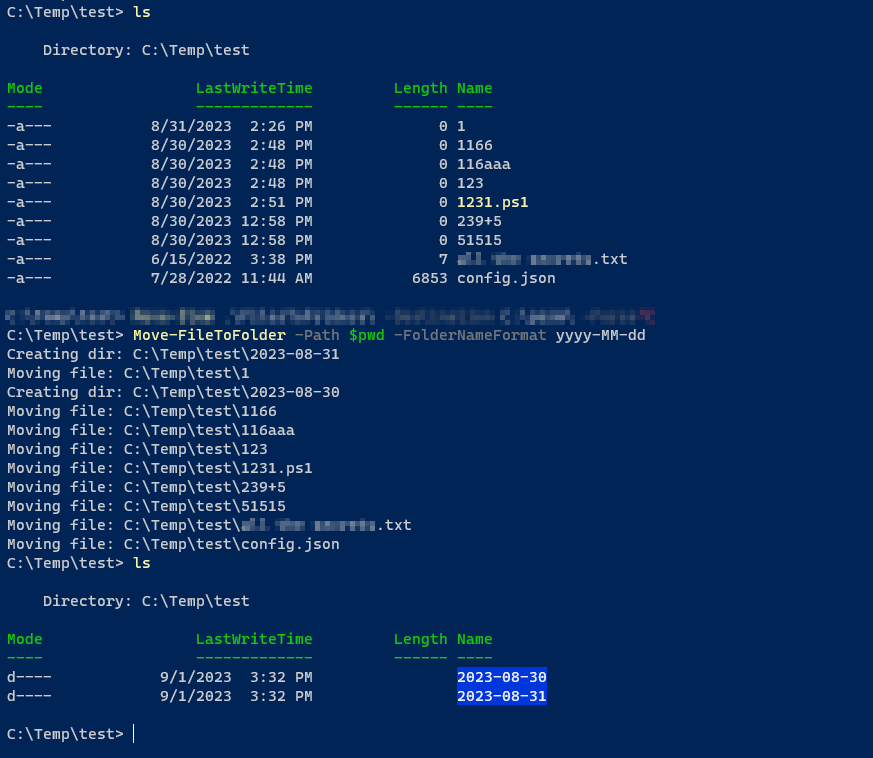

# FilesToFolders

Creates folders based on date, moves files there.

FolderNameFormat accepts `yyyy`, `yyyy-MM`, `yyyy-MM-dd`.

Be sure to read the [docs](https://github.com/ehmiiz/FilesToFolders/blob/master/docs/Move-FileToFolder.md)

Tested on Windows & Ubuntu.