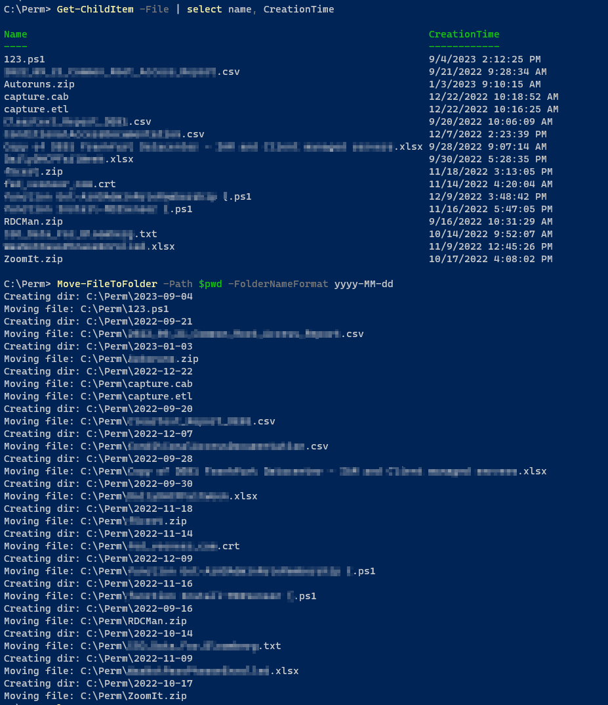
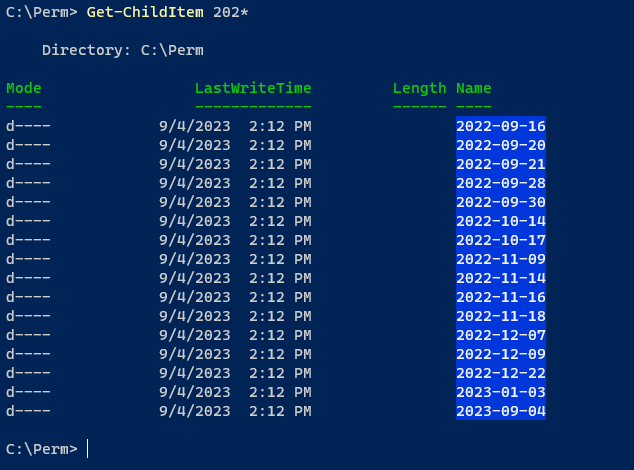

# FilesToFolders

## 📜 Read [docs](https://github.com/ehmiiz/FilesToFolders/blob/master/docs/Move-FileToFolder.md) before use 👍

- File(s)toFolder(s) is built with automation in mind

- Setup a time scheduled action or trigger using your desired automation platform, to automatically move files to structured folders

- Compiled software, efficient and reliable

- Cross-platform

- Supports `-WhatIf` and `-Confirm`, to safely move your data

## Example

List file names and creation date, move them to structured folders

List result of `Move-FileToFolder`

